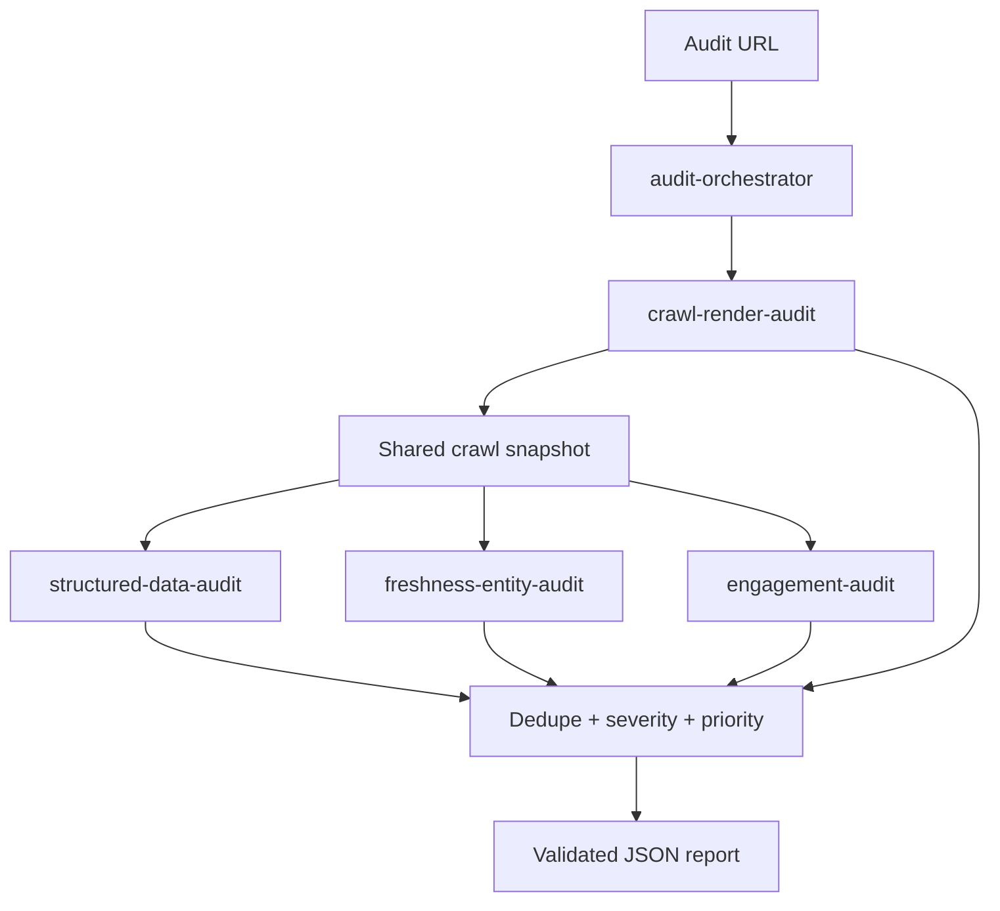

# Brand AI-Readiness Audit

A **single Agent Skill Marketplace** that takes `Audit https://example.com` and returns a validated, evidence-backed report of:

1. **AI discoverability** — why assistants may fail to reach, read, understand, trust, or cite the brand
2. **On-site engagement** — why a visitor who arrives may fail to orient, continue, or act

It is **recommend-only**. Nothing in this marketplace modifies a live website.

```
URL → crawl → robots/indexability → AI-crawler access probe → raw HTML → optional browser render
    → structured data → entities/facts/freshness → engagement
    → deterministic evidence → severity/priority → validated JSON
```

The LLM is optional and never invents evidence. The default path is fully deterministic.

## Why five skills (not one mega-skill)

| Skill | Question it answers |
| --- | --- |
| **audit-orchestrator** (entrypoint) | How do we compose, dedupe, prioritize, and validate one report? |
| **crawl-render-audit** | Can machines reach and read important content — and does the origin actually serve AI crawlers? |
| **structured-data-audit** | Can machines understand the entities this site actually represents? |
| **freshness-entity-audit** | Are facts consistent, disambiguated, and dated when they need to be? |
| **engagement-audit** | Can a new visitor understand the site and take a next step? |

Decomposition is genuine: each skill has its own checks, scripts, and references. The orchestrator does not re-implement them.

## Architecture

```
marketplace.json          contest manifest (exactly one entrypoint)
skills/*/SKILL.md         agentskills.io skills (lean instructions)
skills/*/scripts          thin CLIs over the shared library
src/brand_ai_readiness    deterministic implementation
tests/fixtures/sites      11 synthetic websites for precision tests
```



## Crawl / render strategy

- Same-origin only (configurable)
- Honor `robots.txt` — never circumvent
- **AI-crawler access probe**: the start URL is fetched once as a browser and once each as GPTBot, ClaudeBot and PerplexityBot, and the statuses compared. robots.txt states a policy; the CDN/WAF enforces one, and they can disagree — a site can publish a permissive robots.txt and still 403 every AI crawler. Only a status divergence is reported; a probe identity is never used to retrieve content the audit's own user-agent was denied
- Default budget: **40 pages**, **8 rendered pages**, 15s timeout, concurrency 4, 2MB body cap
- Priority: homepage → sitemap → homepage links → about → product/service → pricing → contact → landings → articles
- Playwright is optional. If browsers are missing, `rendering_status=unavailable` and the audit still completes
- Render comparison fires only when meaningful facts appear after JS (not because JavaScript exists)

Typical audits target **under 5 minutes**.

## What we check

**Discoverability:** robots that actually block audited URLs, AI crawlers refused by the origin despite robots.txt permitting them (and the converse — deliberate exclusion, reported as a policy to confirm rather than a defect), HTTP failures, redirect loops, canonical conflicts, noindex on important pages, unusable sitemaps, broken internal links, raw-vs-rendered gaps, image/canvas-only facts, missing or conflicting JSON-LD/OG that fits the inferred site type.

**Entities / freshness:** inconsistent official names, under-specified brand names, claims copied from visible text only, `dateModified` vs copyright year, stale *time-sensitive* pages. Missing dates are reported as “freshness cannot be established,” not “stale.” Corroboration is optional and defaults to `unavailable`.

**Engagement:** homepage H1 / identity / audience / CTA, nav labels, dead ends, broken paths, missing continuation to pages that actually exist, deep-page context, measurable mobile overflow / missing CTA.

Site type is inferred from signals (ecommerce, article, SaaS, local, docs, nonprofit, university, corporate). We do **not** demand Product schema on a campus site or FAQ schema on everything.

## Evidence and severity

Every finding answers: what is wrong, where, how we know, why it matters, what to change.

Severity is deterministic (`impact × scope × confidence`):

- **critical** — fundamental barrier (homepage down, important URLs blocked)
- **high** — important pages or facts, high confidence
- **medium** — real weakness, limited scope
- **low** — optimization

Scores (`ai_discoverability_score`, `engagement_score`, `overall_score`) are weighted sums of the same observables. Formula is embedded in the report.

## Safety

- GET/HEAD only
- No forms, logins, or authenticated areas
- No robots.txt bypass
- Probe identities are diagnostic only: a block is recorded as a finding, never worked around
- Bounded concurrency, timeouts, response size
- Portable: no external service is required to resolve the marketplace
- No model weights, no secrets

## How to run

```bash
python3.11 -m venv .venv
source .venv/bin/activate
pip install -e ".[dev,render]"
# optional, for raw-vs-rendered + mobile:
playwright install chromium

python -m brand_ai_readiness https://example.com -o report.json
# or
python skills/audit-orchestrator/scripts/run_audit.py https://example.com -o report.json

python skills/audit-orchestrator/scripts/validate_report.py report.json
```

No API key is required. `OPENAI_API_KEY` plus `--llm-polish` may rewrite recommendation wording over already-collected evidence.

## Deploy on Vercel

This repo is a CLI marketplace. Vercel also hosts it as a FastAPI app (`app.py`, `tool.vercel.entrypoint = "app:app"`).

```bash
pip install -e ".[web]"
uvicorn app:app --reload
```

Open http://127.0.0.1:8000 and enter a website. Hosted scans skip browser rendering and cap the crawl at 20 pages. `POST /api/audit` still returns the JSON report if you need it.

## How to test

```bash
pip install -e ".[dev]"
pytest
# optional live network:
pytest -m live
```

Synthetic sites live in `tests/fixtures/sites/` (excellent, robots-blocked, JS-only, missing/conflicting structured data, stale, ambiguous entity, image-only facts, broken nav, disco/engagement splits, UA-gated origin).

If `skills-ref` is installed:

```bash
skills-ref validate ./skills/audit-orchestrator
skills-ref validate ./skills/crawl-render-audit
skills-ref validate ./skills/structured-data-audit
skills-ref validate ./skills/freshness-entity-audit
skills-ref validate ./skills/engagement-audit
```

## Example input

```text
Audit https://example.com
```

## Example output (floor)

See [`examples/sample-report.json`](examples/sample-report.json). Required shape:

```json
{
  "site": "example.com",
  "audited_at": "2026-09-20T14:32:00Z",
  "summary": { "total_findings": 6, "critical": 1, "high": 2, "medium": 3 },
  "findings": [
    {
      "id": "F-001",
      "title": "No JSON-LD structured data on product pages",
      "severity": "high",
      "evidence": "Crawled 12 product pages; 0/12 contain schema.org markup.",
      "suggested_action": {
        "summary": "Add Product/Offer JSON-LD to every product page.",
        "priority": "high"
      }
    }
  ]
}
```

This marketplace also emits `confidence`, `source_urls`, `proactive_recommendations`, `coverage`, and `scores`. Coverage language is observational: *“0/8 representative pages contained…”* not *“the website has none anywhere.”*

## Packaging

```bash
python scripts/package_zip.py
```

Writes `brand-ai-readiness-audit.zip` with `marketplace.json` at the ZIP root. Size stays far below the 50 MB cap (no browsers, no weights).
